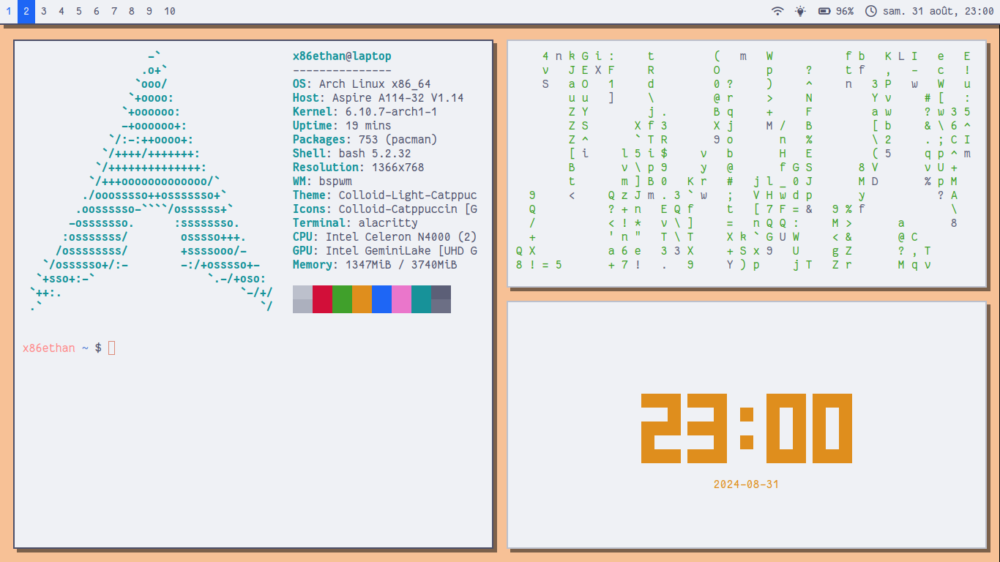
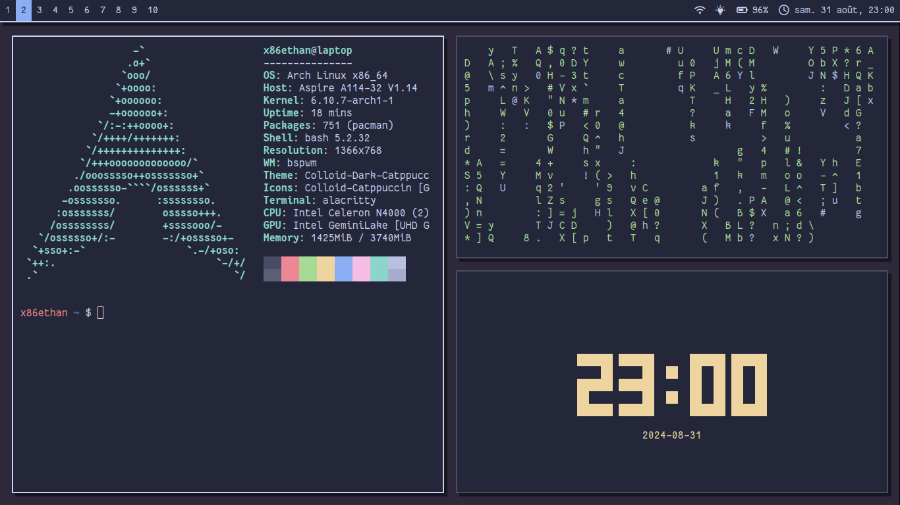

# My entire BSPWM Setup w/ Catppuccin
This repository reflects my entire setup on Arch Linux with [BSPWM](https://github.com/baskerville/bspwm), powered by [Catppuccin](https://catppuccin.com).  

## Screenshots

## Programs I use

 - 🪟 Window Manager: [BSPWM](https://github.com/baskerville/bspwm)
 - ⌨  Keyboard shortcuts handler: [SXHKD](https://github.com/baskerville/sxhkd)
 - 📦 Program launcher: [Rofi](https://github.com/davatorium/rofi)
 - 〰️ Bar: [Polybar](https://polybar.github.io/)
 - 💾 Terminal Emulator: [Alacritty](https://alacritty.github.io)

